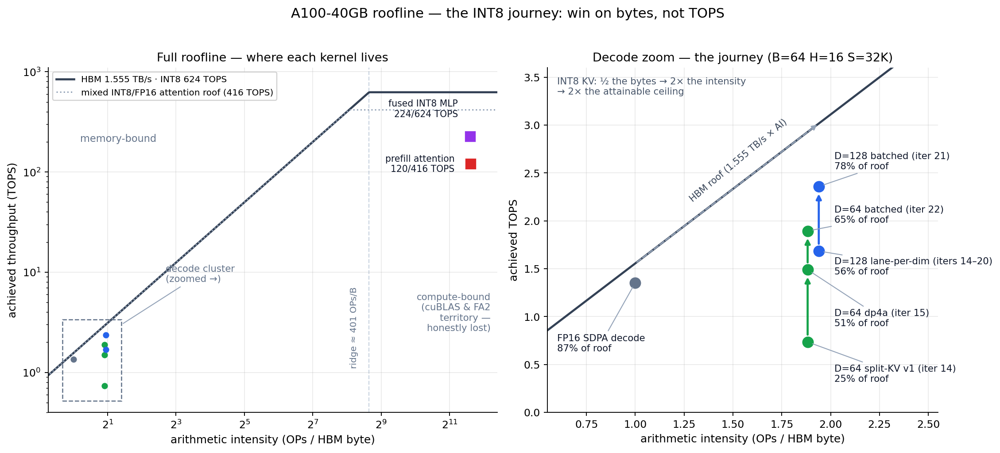

# int8-transformer-kernels

[](https://github.com/Ashuuuri/int8-transformer-kernels/actions/workflows/build-check.yml)

Hand-written **INT8 transformer inference kernels** for the NVIDIA A100 —
attention (prefill **and** decode) and MLP — in CUDA with WMMA / `mma.sync`
tensor-core paths and `dp4a`, exposed to PyTorch via `torch.utils.cpp_extension`.

**TL;DR**

- **Decode attention beats FlashInfer's production FP8 kernels** at head_dim 64
  (1.14–1.48×) and matches them at head_dim 128 — at equal KV-cache bytes, with
  *better* accuracy.
- The INT8 KV cache **halves the bytes per token**, so decode beats FP16 SDPA
  everywhere (up to 1.89×) and fits **2× the context per card**.
- Accuracy is validated end-to-end: **real GPT-2 perplexity on WikiText-2
  changes < 0.07%**.
- Prefill attention **loses** to FlashAttention-2, and the fused MLP **loses**
  to cuBLAS FP16 on raw GEMM efficiency. Both reported honestly — the thesis
  below explains why that's expected.


Target: A100-SXM4-40GB (`sm_80`), CUDA 12.8, PyTorch 2.7. Full evidence trail
in [`OPTIMIZATION.md`](OPTIMIZATION.md).

---

## The thesis: INT8 wins on **bytes**, not on peak TOPS

LLM inference is **memory-bound** where it matters (decode, long context). INT8
helps not because int8 math is fast, but because int8 **tensors are small**:

1. **Half the KV cache.** Decode attention is a bandwidth-bound GEMV over the
   KV cache. Storing K/V at 1 byte/elem instead of FP16's 2 halves the bytes
   streamed per token — that alone is a ~2× ceiling raise.
2. **Fusion removes HBM round-trips.** The fused INT8 MLP never writes its
   intermediate tensors to HBM. That is why it beats a naive INT8 deployment
   (`torch._int_mm` + separate dequant / GELU / requant) by **3.3–5.1×** even
   though its raw GEMMs are slower than cuBLAS.

The corollary is what INT8 *can't* do: prefill and big GEMMs are
**compute-bound**, so smaller bytes buy nothing there — these kernels lose to
FlashAttention-2 and cuBLAS FP16, and no amount of tuning changes that.
Every optimization here was therefore judged by **wall-clock latency and bytes
moved**, never by tensor-pipe % for its own sake.



*The thesis on one chart. Left: prefill/MLP sit on the compute-bound side of
the ridge where INT8 bytes can't help; decode sits at ~2 OPs/byte where they
are everything. Right: FP16 SDPA already runs at ~87% of its roof — the only
way past it is more intensity (INT8 KV halves the bytes → 2× the ceiling), and
the kernel work climbs to 65% (D=64) / 78% (D=128) of that raised roof.
Regenerate with `python figures/make_roofline.py`.*

---

## Headline results (A100-SXM4-40GB)

All latencies are **medians of ≥5 runs** (each the mean of 50 timed iterations
with CUDA events); run-to-run noise on this box is ~2%. Peer versions and the
exact environment are pinned under [Reproducing](#reproducing-the-snapshot).

### Decode attention — INT8 KV cache (the strongest result)

| Baseline | KV bytes/elem | head_dim 64 | head_dim 128 |
|---|---|---|---|
| FP16 SDPA | 2 | **1.45–1.89×** at serving scale (B≥32); 1.10–1.31× even at B=8 | **1.74–1.82×** |
| FlashInfer FP16 | 2 | **1.45–1.62×** | **1.74×** |
| **FlashInfer FP8** (the SOTA peer) | 1 (equal) | **1.14–1.48× — wins outright** | **par**: 0.89–1.07× (wins ≤8K ctx, −10% at ≥16K) |

Beating the FP8 peer matters because it is the *equal-bytes* comparison: at the
same 1 byte/elem KV bandwidth, the win is **kernel quality**, not just
"quantized vs unquantized". And the INT8 side is *more accurate* — per-token
INT8 scales vs FP8's per-tensor scale, output cosine **0.99995 vs 0.99922**.
On Ampere INT8 is also the right format: `sm_80` has no FP8 tensor cores, so
FP8 peers pay a software-dequant tax.

Effective KV-read bandwidth: ~0.95 TB/s (D=64) / ~1.18 TB/s (D=128) — 61–76%
of the A100-40GB HBM peak.

**Fairness notes** (both measured, not hand-waved):

- *Peer version drift*: numbers above are vs **flashinfer 0.6.14**; 0.6.12 was
  up to ~18% slower at some shapes.
- *Paged vs contiguous KV*: FlashInfer serves paged KV (PAGE=16, the
  vLLM-style production config) while ours is contiguous. Re-measured at
  PAGE=256 the paging tax (~3–12%) narrows things: the D=64 win holds
  (1.14–1.31×), D=128 reads 0.86–0.88×.


*Left: vs FlashInfer FP8 at equal 1 byte/elem KV. Middle: vs FlashInfer FP16
(2× the KV bytes). Right: accuracy at equal bytes.*

### MLP — the fusion win

| Baseline | Result |
|---|---|
| Naive INT8 deployment: `torch._int_mm` + separate dequant / GELU / requant | **3.3–5.1×** |
| Bare two `_int_mm` GEMMs (zero-cost-epilogue lower bound) | **1.6–3.0×** |
| FP16 cuBLAS MLP | 0.64–0.99× (loses — raw GEMM efficiency is not the win) |

### Prefill attention

**Loses to FlashAttention-2.** Prefill is compute-bound, so the INT8 byte
advantage never pays off. Reported, not hidden.

### Accuracy — five gates, real weights

`validation/validate_int8.py` runs five gates, ending in **real GPT-2
perplexity on WikiText-2** with the kernel's exact quantization
(per-channel weight / per-token activation / per-token output):
**perplexity change < 0.07%**.

The per-token *output* quant is load-bearing: naive per-tensor output quant
costs **+64% perplexity** on real GPT-2 weights because it crushes
output-channel outliers.

### End-to-end transformer block

INT8 (attention core + MLP; LayerNorm/residual/projections kept FP16) wins
**only** in bandwidth-bound long-context decode — crossing 1.0× at ~4K context
and reaching **1.51× at 32K** — and loses in compute-bound prefill. Fully
consistent with the per-kernel results above.

---

## Repository layout

```
kernels/
  int8_attention.cu          INT8 prefill attention (WMMA QK^T s8→s32, FP16 PV, online softmax)
  int8_decode_attention.cu   INT8 decode attention (split-KV flash-decoding)
  int8_mlp.cu                INT8 MLP (2× INT8 WMMA GEMM, fused GELU, dynamic + per-channel quant)
  int8_common.cuh            shared device helpers (GELU, f32→i8, cp.async)
  quant_utils.cu             per-tensor quantize/dequantize utilities
  int8_ext.cu                pybind11 bindings (torch cpp_extension.load)

validation/                  accuracy gates + test-data generation
  validate_int8.py           5-gate accuracy validation (Gate 5 = real GPT-2 perplexity)
  check_decode.py            decode correctness harness (16 edge shapes, both head dims)
  gate5_real_kernel.py       standalone real-kernel GPT-2 perplexity driver
  generate_test_data.py      8-distribution INT8 validation datasets
  prepare_real_corpus.py     fetch WikiText-2 for Gate 5

bench/                       latency/throughput + profiling drivers
  sweep.py                   latency/throughput sweep -> results/*.csv
  profile_kernel.py          ncu-friendly driver on the graded shape
  collect_profile.py         torch.profiler per-kernel time split (no sudo)
  bench_attn_sota.py         prefill vs SageAttention (INT8 SOTA peer)
  bench_attn_decode.py       decode vs FP16 SDPA
  bench_decode_sota.py       decode vs FlashInfer FP8 (quantized-KV SOTA peer)
  bench_block.py             end-to-end transformer-block wall-clock (INT8 vs FP16)

tests/
  test_int8.py               Python correctness + benchmark (vs FA2 / cuBLAS)
  cuda/test_int8.cu          pure-CUDA smoke test (reads .bin fixtures)
  gen_testdata.py            writes the .bin fixtures for the smoke test

figures/                     plotting (results/*.csv -> results/figures/*.png)
common/                      shared timing + PyTorch-reference primitives
results/                     committed benchmark snapshot (CSVs + figures)
docs/figures/                curated showcase figures used in this README

evolve.sh                    autonomous profile -> optimize -> validate -> commit loop
CLAUDE.md                    agent operating guide (the optimization principles)
OPTIMIZATION.md              structured iteration log (the full evidence trail)
```

---

## Quickstart

Environment: A100 (`sm_80`), CUDA 12.8, PyTorch 2.7. One-time system setup
(the JIT build needs ninja and the pybind11 headers — details in CLAUDE.md
§"Environment setup"):

```bash
sudo apt-get install -y pybind11-dev
pip install -r requirements.txt        # PyTorch itself: install the wheel matching your CUDA
```

Then:

```bash
# pure-CUDA smoke test
python tests/gen_testdata.py
make test_int8 && ./test_int8

# Python correctness + benchmark (JIT compile ~2 min first time, then cached)
python tests/test_int8.py --quick      # correctness only
python tests/test_int8.py              # + FA2 / cuBLAS baselines

# accuracy validation (the gate for every optimization) — run from the repo root
python validation/generate_test_data.py    # one-time: 8 datasets
python validation/prepare_real_corpus.py   # one-time: WikiText-2 for Gate 5
python validation/validate_int8.py         # all datasets × both kernels × 5 gates
python validation/check_decode.py          # decode: 16 edge shapes × both head dims

# performance — run from the repo root
python bench/sweep.py --kernel int8_attn
python bench/sweep.py --kernel int8_mlp
python bench/bench_decode_sota.py          # decode vs FlashInfer FP8
python figures/make_figures.py             # -> results/figures/*.png
```

CI runs a GPU-free `nvcc -arch=sm_80` compile check on every push
(`.github/workflows/build-check.yml`).

### Reproducing the snapshot

`results/` (CSVs + figures) is checked in as the published benchmark snapshot;
regenerate with the commands above and re-commit. `testdata/` is generated
locally and not checked in.

Provenance of every reported number:

- **Timing**: mean of 50 timed iterations (10 warmup, CUDA events) per run;
  claims use the **median of ≥5 runs**. Run-to-run noise ~2% on this box.
- **Peers**: `flashinfer-python==0.6.14` (pinned in `requirements.txt` —
  version moves the FP8 ratios by up to ~18%), PyTorch 2.7, CUDA 12.8.

---

## License & provenance

MIT. Continued solo by the repo owner from a CS 5220 course project (originally
3-person; the FP16 baseline kernels were dropped, and this repo contains only
the owner's INT8 track — kernels, tooling, docs). FP16/cuBLAS/SDPA and external
INT8/FP8 kernels are used as *reference baselines* via PyTorch and pip
packages, because the point is to measure against something real.

See [`OPTIMIZATION.md`](OPTIMIZATION.md) for the full iteration history and
[`CLAUDE.md`](CLAUDE.md) for the operating principles used while extending it.
