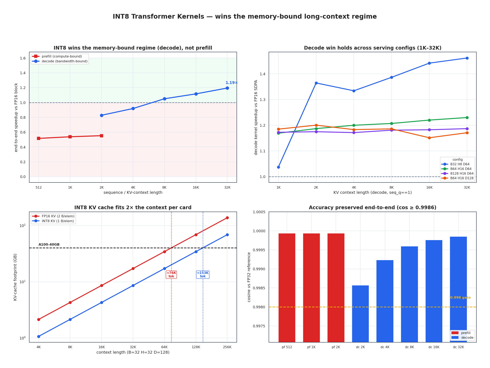
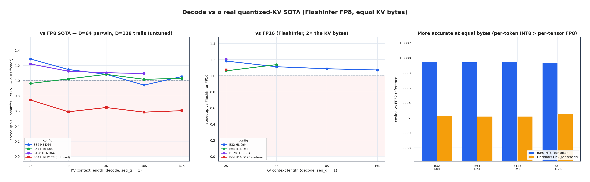

# int8-transformer-kernels

Fused **INT8 transformer inference kernels** for the NVIDIA A100 (`sm_80`,
CUDA 12.8) — attention (prefill **and** decode) and MLP — written in CUDA with
WMMA / `mma.sync` tensor-core paths and `dp4a`, exposed to PyTorch via
`torch.utils.cpp_extension`.

This repo is the INT8 track extracted from a larger CUDA transformer
optimization project (originally a 3-person course project; the INT8 kernels
were then taken solo through ~18 optimization iterations). It keeps **only the
INT8 kernels, their tooling, and the docs** — the FP16 baseline kernels were
dropped. FP16/cuBLAS/SDPA and external INT8/FP8 kernels are still used as
*reference baselines* (via PyTorch and pip packages), because the whole point is
to measure the INT8 kernels against something real.



> The headline: INT8 wins the **memory-bound** decode regime (not prefill), the
> win **grows with context length** and **holds across serving configs**, the KV
> cache fits **2× the context per card**, and accuracy is **preserved end-to-end**
> (cos ≥ 0.9986). Numbers below; full evidence in [`OPTIMIZATION.md`](OPTIMIZATION.md).

---

## The thesis: INT8 wins on **bytes**, not on peak TOPS

The headline number is *not* tensor-core utilization. On raw GEMM
micro-efficiency these hand-written kernels lose to cuBLAS (INT8 GEMM runs
~0.71–0.88× FP16 cuBLAS throughput, and that gap is structural). **That is not
the value proposition.**

The value is at the **workload** level, where inference is **memory-bound**:

- **Fusion removes HBM round-trips.** A fused INT8 MLP forward beats a *naive
  INT8 deployment* — `torch._int_mm` + separate dequant / GELU / requant —
  by **~3.8–4.8×**, because it never round-trips the intermediate tensors
  through HBM. Peak TOPS is irrelevant when the bottleneck is bytes moved.
- **INT8 halves the KV cache.** In **decode**, where attention is a
  bandwidth-bound GEMV over the KV cache, storing K/V at 1 byte/elem (vs FP16's
  2) halves the bytes streamed per token — the kernel can then *beat* FP16
  attention and fit 2× the context per card.

So every optimization here is judged by **wall-clock latency** and **bytes
moved / kernel launches**, never by a stall-counter for its own sake. A change
that raises tensor-pipe % but adds an HBM round-trip is a loss; one that lowers
it but removes a round-trip is a win.

---

## Headline results (A100-SXM4-40GB)

> Measured numbers and the full evidence trail are in
> [`OPTIMIZATION.md`](OPTIMIZATION.md). Latencies are medians of ≥5 runs;
> run-to-run noise on this box is ~2%.

### Decode attention — INT8 KV cache (the strongest result)

| Comparison (equal-or-fairer peer) | Result |
|---|---|
| vs **FP16 SDPA**, serving scale (B≥32) | **WIN** both head dims: D=64 **1.24–1.56×** (`dp4a`), D=128 **1.23×** (split-KV), at **half the KV bytes** |
| vs **FlashInfer FP8** decode (same 1 byte/elem KV) | D=64 **par-to-win** (up to **1.28×**) **and more accurate** (cos 0.99995 vs 0.99922); D=128 **loses ~1.5×** (untuned path — a concrete next target) |
| vs **FlashInfer FP16** (well-tuned, 2 bytes/elem) | ~**1.06–1.21×** (the structural half-bytes win, honestly smaller than vs the weaker SDPA baseline) |

At D=64 our INT8 decode is competitive-to-ahead of the **production FP8 SOTA at
equal KV bandwidth, and more accurate** — so the win is real *kernel quality*,
not merely "quantized vs unquantized". On Ampere, INT8 is the *right* quantized
format: `sm_80` has no FP8 tensor cores, so FP8 peers pay a software-dequant tax.



> Left: vs FlashInfer FP8 at **equal 1 byte/elem KV** — D=64 par-to-win, D=128
> trails (untuned). Middle: vs FlashInfer FP16 (2× the KV bytes). Right: at equal
> bytes our **per-token INT8** scales are **more accurate** than FP8's per-tensor
> scale (cos 0.99995 vs 0.99922).

### MLP

- Fused INT8 forward vs the cuBLAS INT8 `_int_mm` + dequant/GELU/requant
  pipeline: **~3.8–4.8×** (the fusion / memory-bound win).
- vs FP16 cuBLAS GEMM throughput: **0.71–0.88×** (and always was — INT8 GEMM
  micro-efficiency is not the win; see the thesis above).

### Prefill (square) attention

- **Loses to FlashAttention-2** — prefill is compute-bound, so the INT8 byte
  advantage does not pay off there. Honestly reported, not hidden.

### Accuracy

Five-gate validation (`validate_int8.py`), including **real GPT-2 perplexity on
WikiText-2** with the kernel-faithful per-channel-weight / per-token-activation /
per-token-output quantization: **perplexity change < 0.07%**. (Naive per-tensor
output quant gives +64% perplexity on real weights — per-token output quant is
the fix.)

### End-to-end transformer block

INT8 (attention core + MLP, with LayerNorm/residual/projections kept FP16) wins
**only** in the bandwidth-bound long-context **decode** regime (crosses 1.0× at
~8K context, up to **1.19× @ 32K**) and loses in compute-bound prefill — fully
consistent with every per-kernel result.

---

## Repository layout

```
kernels/
  int8_attention.cu          INT8 prefill attention (WMMA QK^T s8→s32, FP16 PV, online softmax)
  int8_decode_attention.cu   INT8 decode attention (split-KV flash-decoding; dp4a @ D=64)
  int8_mlp.cu                INT8 MLP (2× INT8 WMMA GEMM, fused GELU, dynamic + per-channel quant)
  int8_common.cuh            shared device helpers (GELU, f32→i8, cp.async)
  quant_utils.cu             per-tensor quantize/dequantize utilities
  int8_ext.cu                pybind11 bindings (torch cpp_extension.load)

tests/
  test_int8.py               Python correctness + benchmark (vs FA2 / cuBLAS)
  cuda/test_int8.cu          pure-CUDA smoke test (reads .bin fixtures)
  gen_testdata.py            writes the .bin fixtures for the smoke test

validation/                  accuracy gates + test-data generation
  validate_int8.py           5-gate accuracy validation (Gate 5 = real GPT-2 perplexity)
  gate5_real_kernel.py       standalone real-kernel GPT-2 perplexity driver (shared with Gate 5)
  generate_test_data.py      8-distribution INT8 validation datasets
  prepare_real_corpus.py     fetch WikiText-2 for Gate 5

bench/                       latency/throughput + profiling drivers
  sweep.py                   latency/throughput sweep -> results/*.csv
  profile_kernel.py          ncu-friendly driver on the GRADED shape
  collect_profile.py         torch.profiler per-kernel time split (no sudo)
  bench_attn_sota.py         prefill vs SageAttention (INT8 SOTA peer)
  bench_attn_decode.py       decode vs FP16 SDPA
  bench_decode_sota.py       decode vs FlashInfer FP8 (quantized-KV SOTA peer)
  bench_block.py             end-to-end transformer-block wall-clock (INT8 vs FP16)

figures/                     plotting (read results/*.csv -> results/figures/*.png)
  make_figures.py            clean seaborn figure set (hero + themed)
  make_dashboard.py          legacy dashboard + shared plot/data/byte-model helpers

common/                      shared primitives, imported by the above
  benchmark.py / baseline.py / correctness.py   timing + PyTorch references

evolve.sh                    autonomous profile -> optimize -> validate -> commit loop

CLAUDE.md                    agent operating guide (the optimization principles)
OPTIMIZATION.md              structured iteration log (the full evidence trail)
docs/figures/                curated showcase figures used in this README
```

---

## Quickstart

Environment: A100 (`sm_80`), CUDA 12.8, system PyTorch 2.7. The INT8 extension
JIT-builds via `torch.utils.cpp_extension.load`, which needs **ninja** and the
**pybind11 C++ headers on the system include path** — see CLAUDE.md §"Environment
setup" for the exact one-time install (`ninja` + `pybind11-dev`).

```bash
# pure-CUDA smoke test
python tests/gen_testdata.py
make test_int8 && ./test_int8

# Python correctness + benchmark (JIT compile ~2 min first time, then cached)
python tests/test_int8.py --quick      # correctness only
python tests/test_int8.py              # + FA2 / cuBLAS baselines

# accuracy validation (the gate for every optimization) — run from the repo root
python validation/generate_test_data.py   # one-time: 8 datasets
python validation/prepare_real_corpus.py   # one-time: WikiText-2 for Gate 5
python validation/validate_int8.py         # all datasets × both kernels × 5 gates

# performance — run from the repo root (scripts resolve results/ & kernels/ there)
python bench/sweep.py --kernel int8_attn
python bench/sweep.py --kernel int8_mlp
python bench/bench_decode_sota.py          # decode vs FlashInfer FP8 (needs flashinfer-python)
python figures/make_figures.py             # -> results/figures/*.png
```

`results/` (CSVs + figures) **is** checked in as the published benchmark snapshot;
regenerate it with the commands above and re-commit. `testdata/` is generated
locally and is **not** checked in (rebuild with `validation/generate_test_data.py`).

---

## License & provenance

Continued solo by the repo owner from a CS 5220 course project; this repo
contains only the owner's INT8 work. See [`OPTIMIZATION.md`](OPTIMIZATION.md)
for the full iteration history and [`CLAUDE.md`](CLAUDE.md) for the operating
principles an agent should follow when extending it.
